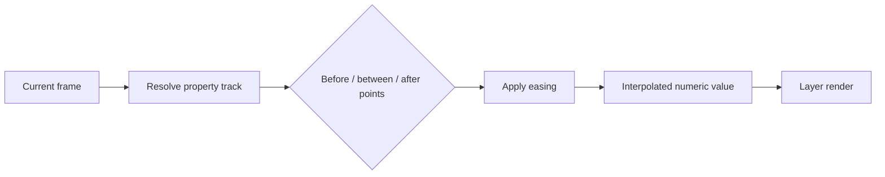

Animation in Tessact is property-based. A layer keeps base values plus a map of keyframe tracks. Each track is an ordered series of `{ frame, value, easing }` records.

<Frame caption="A Scale keyframe lane in the Wayanad timeline">
  
</Frame>

## Evaluation model

- Before the first point, the first keyframe value holds.
- After the last point, the last value holds.
- Between points, progress is normalized from 0–1 and transformed by easing.
- With no track, the stored base value is used.

## Frame addressing

Keyframe frames are composition-frame numbers, rounded to integers, sorted, deduplicated, and constrained to non-negative values. A layer's creation controls allow a point inside its interval or at its end edge; render visibility still follows the layer's half-open active interval.

## Track identity

Position supports legacy aliases: horizontal tracks can be `left` or `x`, and vertical tracks `top` or `y`. Resolution selects the active representation and writing preserves the established key where possible. Effect tracks include the effect instance ID; shadow tracks include the shadow index.

## Recommended motion workflow

1. Establish a static start design.
2. Add the minimum necessary property tracks.
3. Place start and end points on meaningful story frames.
4. Edit values numerically or through canvas gestures.
5. Choose easing based on intent.
6. Inspect the motion path and intermediate frames.
7. Test at normal playback speed.

<Tip>
  Two well-chosen keyframes often communicate more clearly than a dense track. Add an intermediate point only when the path or rhythm requires a new decision.
</Tip>

Continue to [animatable properties](/editor/animation/animatable-properties) and [add keyframes](/editor/animation/add-keyframes).
