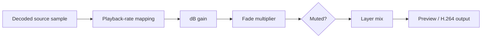

Audio can come from audio-only layers or a video's embedded audio track. Every audible layer contributes to a shared composition mix.

## Signal path

## Control surfaces

| Surface | Controls |
| --- | --- |
| Layer inspector | Base volume and playback rate |
| Timeline clip | Waveform, draggable volume line, fade handles |
| Timeline row | Mute state |
| Playback strip | Preview mute |

Each surface has a different scope. Preview mute silences monitoring; a row mute changes the composition contribution; volume changes the layer gain; fades vary gain over the clip.

## Editorial passes

1. **Assembly** — synchronize picture, narration, music, and effects.
2. **Cleanup** — trim silence and add short boundary fades.
3. **Balance** — establish speech first, then music and ambience.
4. **Automation check** — review every long fade and rate-adjusted source.
5. **Output check** — listen from first to last frame with all intended rows active.

<Note>
  The editor stores gain as a decibel adjustment. At the minimum value, the conversion returns zero gain; otherwise linear gain is `10^(dB/20)`.
</Note>

See [Volume](/editor/audio/volume), [Fades](/editor/audio/fades), and [Waveforms](/editor/audio/waveforms).
