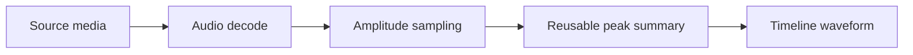

A waveform is a visual summary built from decoded audio. It is generated independently from real-time playback and can therefore load on a different schedule.

## Waveform preparation

The waveform condenses many audio samples into each visible timeline column. Zooming changes how much detail can be represented, and prepared peak summaries can be reused while you change the timeline view.

## Read responsibly

Waveform height is a relative amplitude cue, not a calibrated loudness meter. It does not include every downstream gain, fade, mute, or overlap decision. Use it to find starts, pauses, transients, and broad dynamics; use listening for balance.

## Video waveforms

A video layer draws a waveform only when its asset metadata reports an audio track and the audio stream can be decoded. A filmstrip can succeed while waveform generation fails because visual and audio streams are separate.

## Missing waveform checklist

1. Confirm the layer is audio or a video with an audio track.
2. Verify source playback works.
3. Allow media loading and browser decoding to finish.
4. Increase timeline width or zoom.
5. Check the browser console and network panel for media access or decode errors.

<Note>
  A missing waveform does not necessarily block rendering. It removes an editing aid; direct playback remains the truth for audible content.
</Note>

See [filmstrips and waveforms](/editor/timeline/filmstrips-waveforms) and [media troubleshooting](/editor/troubleshooting/media).
