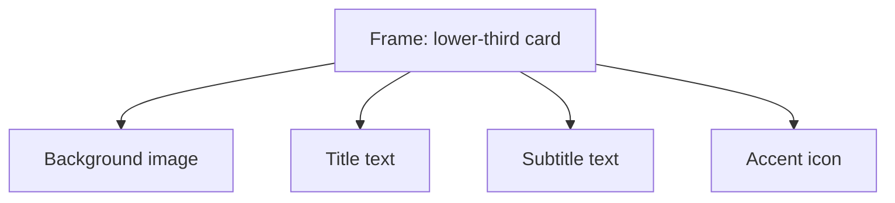

A frame is both a drawable visual layer and a potential parent container. It can have its own transform, fill, blend mode, rounded corners, stroke, crop, timing, and children.

## Create a frame

Choose the **Frame** tool from the right rail, then drag a rectangle on the canvas. Frame is a one-shot drawing tool: pointer-up creates the layer and automatically returns the editor to **Select**. A click without a drag creates nothing. A newly drawn frame initially spans `100` composition frames from the current playhead unless automatic nesting replaces that interval.

### What happens when the rectangle encloses layers

Drawing a frame around eligible visible layers can do more than paint a rectangle. When the enclosed candidates are structurally compatible, the editor automatically parents them to the new frame, replaces the frame's default `100`-frame interval with the union of their active intervals, and inserts the frame above the first enclosed track. Candidates that already belong to incompatible or mixed parents are not silently combined into one new hierarchy.

After pointer-up, verify three things in the timeline: the frame interval, its track position, and the descendants that moved under it. An object can look enclosed geometrically without being eligible for automatic nesting.

## Frame an existing selection

Select eligible visual layers and press `Shift+2` or choose **Frame selection**. The editor computes a frame from the selected layers' rendered bounds at the current composition frame and uses the union of their timing intervals. Because animated crop, scale, and geometry are evaluated at the current frame, seeking first changes the rectangle that this command derives.

## Navigate and restructure nested content

- Double-click a selected frame over a descendant to drill into the highest eligible descendant under the pointer.
- Drag an eligible layer fully into an auto-layout frame to nest it on release; the container then owns its flow placement.
- Drag an in-flow child fully outside its auto-layout frame to detach it. Its new free placement is resolved into the destination coordinate space.
- Undo immediately if a drag crosses a parent boundary you did not intend. Reparenting changes hierarchy, geometry ownership, and potentially layout behavior in one transaction.

## Frame inspector

| Section | Controls |
| --- | --- |
| Transform | Alignment, position, dimensions, rotation, scale |
| Auto layout | Manual, auto-layout frame, or grid frame plus layout parameters |
| Frame | Opacity, blend mode, fill color, border radius, stroke width, stroke color |
| Crop | Visible frame bounds where available |
| Clip content | Hide or reveal descendant overflow beyond the frame bounds |

## Visual and structural roles

Use a frame visually as a card, panel, mask-like bounded region, or title background. Use it structurally to move, time, and lay out several descendants as a unit. A frame can serve both roles; its own fill and stroke remain visible behind or around its children.

**Clip content** controls descendant overflow independently of the frame's own crop values. Enable it when children must be visually constrained to the frame rectangle; disable it when badges, shadows, or deliberately oversized descendants should extend beyond that box.

## Timing

A frame is a timed layer. Its children may have their own intervals, but a child cannot contribute visible output outside the effective parent context. Inspect nested timing when a descendant unexpectedly disappears.

<Tip>
  Start a reusable module as a manual frame. Once the children and hierarchy are correct, switch to auto layout or grid and deliberately resolve any position changes.
</Tip>

Continue with [parenting](/editor/canvas/parenting), [auto layout](/editor/canvas/auto-layout), and [grid layout](/editor/canvas/grid-layout).
