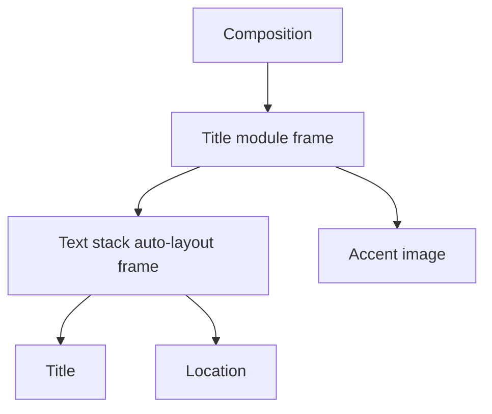

Parenting makes a layer a descendant of a frame. The child is composed within the frame's coordinate, layout, order, and timing context.

## Why parent layers

- Move and time a lower-third as one module.
- Keep text aligned within a card when the card resizes.
- Build nested auto-layout or grid systems.
- Apply a clear compositional hierarchy instead of coordinating many free layers.

## Parent-placement behavior

A manual frame can contain absolute children. An auto-layout frame converts direct children to flow items; a grid frame converts them to grid items. Parent controls may expose placement, self-alignment, order, and constraints appropriate to that parent mode.

## Valid hierarchy

The editor validates frame ancestry to prevent cycles. A frame cannot become its own descendant, directly or indirectly. Removing or changing a parent requires resolving the child's coordinates into the new space so it does not jump unexpectedly.

## Effective timing

A child has its own start and duration, but visible contribution is also constrained by the parent chain. For nested structures, reason about the intersection of active intervals rather than only the child's row.

## Animation and offsets

Parent motion affects every descendant. Child motion is evaluated within the moving parent. Layout-managed position and ordinary keyframed position use different ownership rules, so inspect tracks after reparenting.

<Warning>
  Reparenting is a structural transformation, not just a layer-order change. Review canvas geometry, timeline timing, keyframe lanes, and render boundaries immediately afterward.
</Warning>

See [auto layout](/editor/canvas/auto-layout), [grid layout](/editor/canvas/grid-layout), and [frame inspector](/editor/layers/frame).
