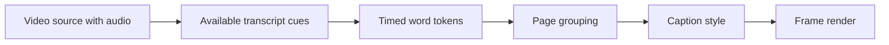

Captions combine two models: a caption asset containing timed tokens and a visual layer defining placement, typography, page grouping, appearance, and animation.

## Caption asset

Each token stores text, start time, end time, and related metadata. Token time is in milliseconds and remains independent from the visual layer's pixel geometry.

## Caption layer

The layer places the asset in composition time with `from`, duration, and a caption source offset. It also stores font family, weight, size, line height, tracking, color, highlight color, alignment, stroke, maximum lines, page duration, and selected subtitle style.

## Pages

At render time, tokens are grouped into pages according to their timing and the configured maximum page duration. The active page is chosen for the current frame, then text is fit into the caption box and styled.

## Recommended workflow

1. Create captions from a video source with a detected audio track.
2. Correct token text and timestamps before styling.
3. Tune page duration and maximum lines.
4. Place and size the caption box against representative frames.
5. Establish typography, fill/highlight color, stroke, and shadow; add a separate backing solid or frame when an explicit box is needed.
6. Add restrained animation.
7. Review every page at normal playback speed.

<Warning>
  Do not use visual animation to disguise incorrect transcript timing. Fix token start and end times first.
</Warning>

Start with [Create captions](/editor/captions/create), then continue to [edit text](/editor/captions/edit-text), [timing](/editor/captions/timing), and [style](/editor/captions/style).
