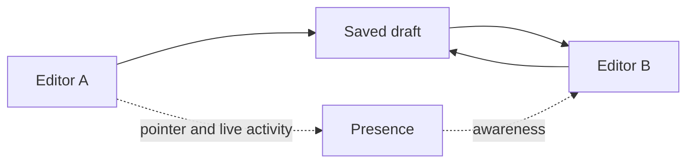

Collaboration has two visible parts:

- **Saved draft changes** keep the creative result consistent for everyone with access.
- **Live activity cues** show who is present and where someone may be working right now.

## Saved creative changes

Autosave preserves changes that affect the video, including composition settings, tracks, layers, timing, captions, layout, effects, shadows, and keyframes. After synchronization, collaborators see the same creative result even when their local view of the editor is different.

## Live activity cues

Presence can show active collaborators, remote pointers, and highlights for supported canvas or timeline operations. These cues help people avoid editing the same item at the same time. They can briefly lag or disappear during a connection change without removing already saved work.

## Concurrent changes

People can usually work efficiently in separate scenes, time ranges, or layer groups. Risk increases when two people change the same layer, reorder neighboring clips, adjust parent layouts, or resize the composition at the same time. In those cases, one saved result can replace an overlapping change.

Use presence as a coordination signal, and agree on ownership before making structural edits.

## Session-only view settings

The following can differ between collaborators without affecting the draft:

- playhead position and playback state;
- selected layer and focused field;
- open Inspector sections;
- panel sizes and timeline zoom;
- local undo and redo history.

<Warning>
  Presence is evidence of activity, not a lock. A pointer or live highlight helps you coordinate, but it does not prevent a competing edit.
</Warning>

Continue to [presence and live activity](/editor/collaboration/presence), [how autosave works](/editor/collaboration/autosave), and [concurrent editing](/editor/collaboration/concurrent-edits).
