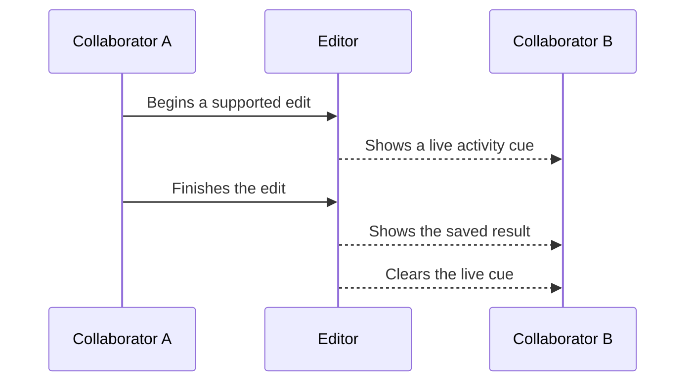

Presence helps collaborators see who is active and where work may be happening. The top bar can show active people, while the canvas and timeline can show supported live interactions.

## Collaborator identity

Active collaborators appear with initials and a consistent color during the session. If profile information is unavailable, the editor uses a neutral label so collaboration can continue.

## Canvas activity

For supported visual layers, you may see a collaborator's pointer or a colored outline while they move, resize, crop, or adjust an item. The cue follows the canvas view so it remains aligned as you zoom or pan.

Audio-only layers do not appear as canvas outlines. Check the timeline when someone is working with audio.

## Timeline activity

The timeline can show when another person is moving, trimming, or adjusting a clip. A live cue may remain briefly while the saved result appears, helping you connect the in-progress action with the finished change.

## From live activity to a saved change

## Presence etiquette

- Avoid dragging or trimming an item that already shows another person's activity cue.
- Divide work by scene, layer group, or time range.
- Announce composition-size, parent-layout, or large timeline changes.
- Pause when a collaborator disappears during a critical edit; they may be reconnecting.
- Confirm intent directly when two people reach the same layer at once.

<Note>
  Presence can be delayed or temporarily unavailable without affecting changes that have already been saved. Use it for awareness, not as proof that a layer is locked.
</Note>

See [concurrent editing](/editor/collaboration/concurrent-edits) for ownership patterns and conflict recovery.
