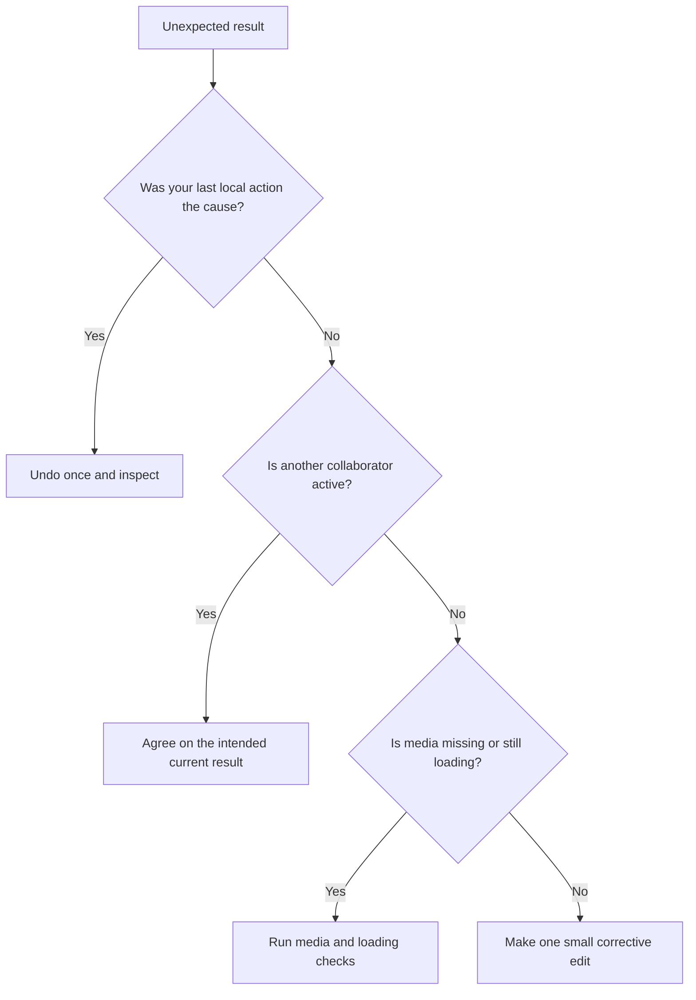

Undo and redo belong to the current editor session. They are designed to reverse your recent editing actions, not to provide a complete history of everything every collaborator has done.

## What local history can do

- Reverse a recent layer, timeline, Inspector, caption, effect, or keyframe edit made in the current session.
- Treat a continuous drag or value scrub as a useful editing step.
- Restore an undone action with redo until a new edit creates a different direction.

## What it cannot guarantee

- A chronological record of every collaborator's action.
- A rollback containing only one person's changes.
- Restoration of media that is no longer available to the workspace or browser.
- A predictable reversal after two people edited the same layer or structure.
- Recovery of the prior session's local history after a reload or tab close.

## Recovery decision tree

## Safe recovery protocol

1. Pause playback and finish any active gesture.
2. Note the current frame, selected layer, and visible timeline range.
3. If the mistake is clearly your most recent action, undo exactly once.
4. Verify the result on both the canvas and timeline.
5. Stop if the result removes or changes something another person intended.
6. Agree on the desired result, then make a small explicit correction from the current draft.

<Warning>
  Reloading clears session-only context, including local undo history. Give autosave time to finish and inspect the current shared result before refreshing.
</Warning>

## When to contact support

If undo produces a repeatable incorrect result, include the draft name, approximate time, selected layer, action performed, result expected, result observed, and a short screen recording with the canvas and timeline visible. Do not include passwords or private media URLs.

For non-history failures, see [editor loading](/editor/troubleshooting/editor-loading), [media troubleshooting](/editor/troubleshooting/media), and [how autosave works](/editor/collaboration/autosave).
