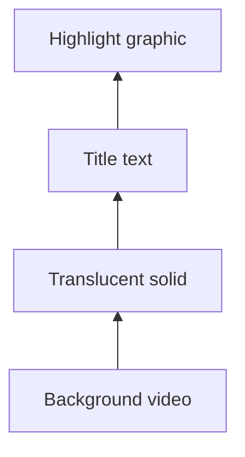

Alignment controls modify geometry; layer-order controls modify compositing order. They solve different problems and often work together—for example, centering a title and then bringing it above its supporting solid.

<Frame caption="Shared controls for a mixed multi-selection">
  
</Frame>

## Align a single layer

With one top-level layer selected, alignment targets the composition: left, horizontal center, right, top, vertical center, or bottom. A child layer can instead align within its parent content box. Read the inspector's alignment scope label before applying the command.

## Align a selection

With multiple layers selected, alignment uses the selection's collective bounds. The furthest edge or computed center becomes the reference, and eligible layers move relative to it. This makes icon rows, title stacks, and lower thirds consistent without manually calculating every coordinate.

## Distribute spacing

With at least three eligible visual layers, distribute horizontally or vertically to preserve the two outer anchors and space the intermediate layers evenly. Use `Option/Alt+Shift+H` for horizontal distribution and `Option/Alt+Shift+V` for vertical distribution. Distribution changes positions, not layer order or timing.

## Understand layer order

Visual layers are painted in a deterministic order. Moving a layer forward or backward changes which pixels cover which; it does not change timing. The timeline's vertical ordering and the canvas result should be read together.

The timeline context menu's **Bring to front** / **Send to back** targets the right-clicked item even when a larger selection exists. Keyboard commands `Cmd/Ctrl+Shift+]` and `Cmd/Ctrl+Shift+[` operate on the applicable current selection. Confirm the target before reordering an overlapped stack.

## Containers complicate order by design

Children are composed inside their frame. Reordering a child changes its position among siblings, while reordering the frame moves the container and its composed descendants relative to top-level layers. If a child refuses to cross an apparent boundary, inspect whether the target layer belongs to a different parent.

<Warning>
  Aligning a property with active keyframes can create or update values at the current frame. Review animation lanes after aligning animated layers.
</Warning>

See [frames](/editor/canvas/frames), [parenting](/editor/canvas/parenting), and [multi-selection](/editor/layers/multi-selection).
