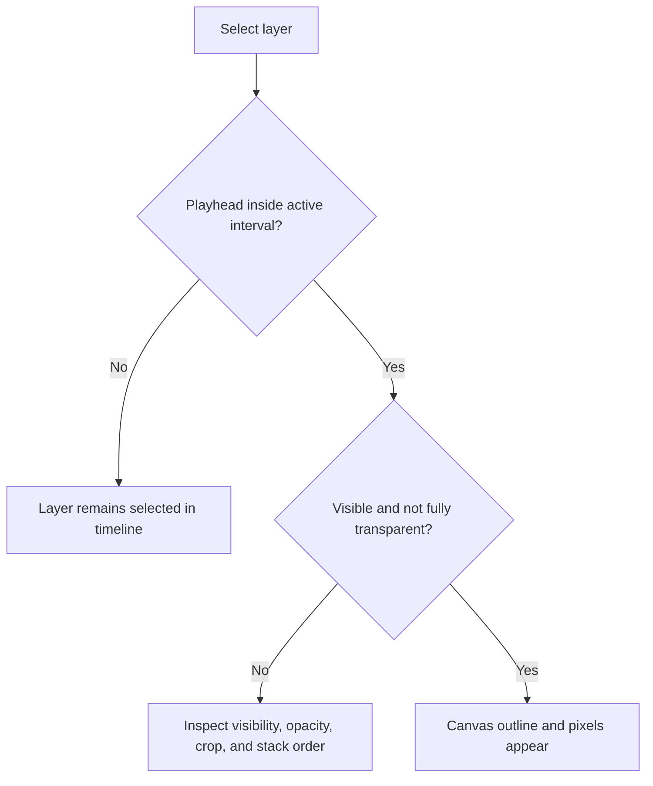

import { SelectionWarning } from '/snippets/editor-notes.mdx'

Selection is the editor's routing mechanism. It determines which outline appears, which timeline rows are highlighted, which inspector opens, and which layers receive an edit.

## Select from the canvas

- Click a visible layer to select it.
- Add or remove a layer from the selection with the platform's additive-selection modifier.
- Drag through empty canvas workspace to create a marquee around multiple eligible layers.
- Click clear workspace to return to a composition-level state.
- When layers overlap completely, use the timeline or context menu rather than repeatedly clicking the same pixel.

## Select from the timeline

Timeline selection is reliable when a layer is off-canvas, transparent, hidden behind another layer, or inactive at the current frame. Select one clip, extend the selection to additional rows, or use a marquee over the timeline body when several clips occupy a clear region.

### Selection can seek

A non-additive clip target is also a visibility aid. If the playhead is before that clip, selecting it seeks to its start; if the playhead is after it, selection seeks to its last visible frame. Clicking a selected canvas layer follows the same edge-seek rule. Additive selection preserves the multi-target workflow instead of repeatedly relocating time.

This matters because the next command reads the resulting frame. After selecting a distant clip, recheck the time display before Split, trim-to-playhead, keyframe insertion, or **Frame selection**.

## Marquee resolution

A canvas marquee clears prior layer and keyframe selection, then selects active non-audio items on non-hidden tracks whose evaluated crop/scale geometry intersects the rectangle; full containment is not required. A timeline marquee begins only after roughly `4 px` of movement. If it intersects any keyframe hitbox, keyframes win and layer selection is cleared; otherwise intersecting clip bodies become the layer selection.

Hidden tracks are excluded from canvas marquee discovery even though their clip bodies remain visible in the authored timeline structure. Timeline marquee selection depends on visible hitboxes in the current viewport.

## Selection versus time

A layer selection can persist while the playhead moves outside that layer's active interval. The inspector can still identify the layer, but the canvas may show no corresponding pixels. Seek into the clip before diagnosing a missing visual.

## Multi-selection semantics

The inspector exposes only properties shared by the current mix of layer types. Shared transforms, opacity, blend mode, alignment, and some typography values may appear; layer-order commands do not appear in the multi-selection inspector. Type-specific controls that cannot be edited safely as a group are omitted. A displayed mixed value means selected layers disagree, not that the property is missing.

<SelectionWarning />

See [multi-selection inspector](/editor/layers/multi-selection), [alignment and layer order](/editor/editing/alignment-layer-order), and [selection diagnostics](/editor/troubleshooting/performance#selection-and-interaction-lag).
