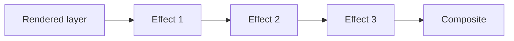

Layer effects transform rendered pixels or text reveal state after core content and layout are resolved. The available add buttons depend on the selected layer type.

<Frame caption="Layer Effects in the selected-layer inspector">
  
</Frame>

## Effect categories

- **Reveal** effects change how eligible text or captions become visible.
- **Post** effects process an already rendered layer surface.

The live add menu filters the catalog by both type support and authorability. Treat that menu as the authority; do not infer that a stored or named effect can be newly added to every layer.

## Processing order

Effects are stored as an ordered array. Moving an effect up or down changes the input received by later effects, so order is part of the design.

Blur before pixelation can produce different edges from pixelation before blur. Film grain before a strong tonal mapping can be suppressed; after it, the grain can remain prominent.

## Controls

Each instance has a stable ID, kind, enabled state, and numeric parameter map. You can enable or disable it, reorder it, remove it, adjust its bounded parameters, and keyframe supported parameters.

## Cost and determinism

Media post effects can require an offscreen canvas and per-pixel processing. Large layers, multiple effects, and high preview resolution increase work. Time-varying visual effects use deterministic frame inputs where required so playback and H.264 output remain repeatable.

<Tip>
  Add effects one at a time, review the whole clip, and compare with the effect disabled. Keep an effect only when it improves the story at normal playback speed.
</Tip>

Continue to [Layer Effects](/editor/effects/layer-effects) and [Shadows](/editor/effects/shadows).
