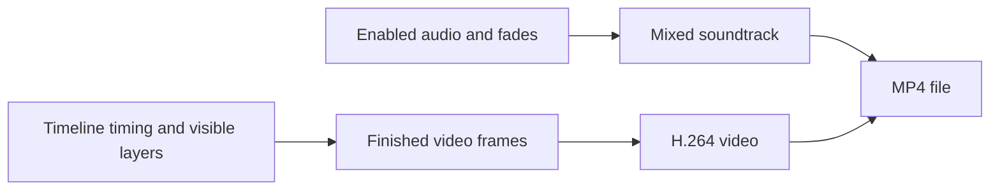

The editor renders video as **H.264 in an MP4 file**. H.264 is the video codec; MP4 is the file container that holds the encoded picture and soundtrack. There is no codec selector in this workflow.

## What determines the result

The finished file follows the draft's customer-controlled settings and content:

| Draft setting | Effect on the MP4 |
| --- | --- |
| Canvas width and height | Output pixel dimensions and aspect ratio |
| Frame rate | Number of output frames per second and the smallest visible timing step |
| Composition duration | Length of the finished video |
| Layer intervals and order | When each item appears and which items cover others |
| Crop, position, scale, and opacity | Placement and visibility inside the canvas |
| Animation and effects | Per-frame movement and visual treatment |
| Captions and text | Rendered wording, timing, wrapping, and styling |
| Enabled audio, volume, and fades | The soundtrack heard in the MP4 |

Output dimensions come from [Canvas settings](/editor/canvas/composition), not the browser window size, page zoom, canvas zoom, or panel layout.

## How timeline timing becomes frames

Video is made of discrete frames. At 30 fps, each frame represents about 33.3 milliseconds; at 60 fps, each frame represents about 16.7 milliseconds. A cut, caption boundary, or keyframe placed between frame boundaries is displayed on the nearest applicable output frame.

This has several practical consequences:

- Very short gaps can still produce a one-frame flash.
- A title ending one frame too early can expose the layer beneath it.
- Fast position or opacity changes should be checked frame by frame.
- Higher frame rates create finer motion timing but also produce more frames for the same duration.

<Note>
  Timeline animation keyframes control creative properties such as position or opacity. They are different from the compression keyframes used by the H.264 format.
</Note>

## Visual composition

For each moment in the timeline, the visible layers are combined in stacking order. Crop, layout, animation, effects, shadows, opacity, and blending determine the final pixels. Transparent source areas reveal the layers beneath them.

Editor-only aids are excluded: the playhead, selection outlines, resize handles, guides, panels, and canvas checkerboards do not appear in the MP4.

## Preview versus downloaded output

The editor preview is designed for responsive editing, while the MP4 is the final frame-by-frame result. Temporary preview stutter does not necessarily appear in the downloaded video. Conversely, details that are easy to miss while scrubbing—such as a single-frame gap, an off-canvas keyframe, or a muted layer—will be preserved in the render.

Always review the downloaded MP4 independently. Pay particular attention to:

- The first and final frames.
- Fast cuts and transitions.
- Small text, thin lines, gradients, grain, and rapid motion.
- Caption line breaks and safe margins.
- Audio starts, fades, overlaps, and the final audible frame.

## H.264 compression and quality

H.264 reduces file size by reusing information across nearby frames. Detailed texture, confetti, water, film grain, fast camera movement, and tiny high-contrast text can be harder to compress than flat or slowly changing images. If a section is visually critical, inspect it at 100% display size rather than relying on a scaled preview.

The editor does not expose separate controls for bitrate, H.264 profile, or audio encoding. Treat the downloaded MP4 as the source of truth and test it against the intended destination's current requirements.

## Delivery checklist

Before publishing or handing off the file:

1. Confirm the pixel dimensions and aspect ratio match the destination.
2. Confirm the frame rate and duration are accepted.
3. Watch the complete MP4 in a current media player.
4. Listen on headphones and speakers for missing speech, clicks, or abrupt fades.
5. Inspect the fastest-moving and most detailed section at full size.
6. Upload a test to the destination and review its processed version; many platforms apply additional compression.
7. Keep the approved local MP4 as the delivery copy.

If the file is missing content, audio, or a download, use [Troubleshoot rendering](/editor/export/troubleshooting).
