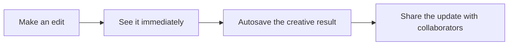

import { AutosaveNote } from '/snippets/editor-notes.mdx'

Every meaningful editor change is saved automatically. This includes layer timing, canvas geometry, appearance, Inspector values, captions, keyframes, composition settings, and media references.

<AutosaveNote />

## The autosave flow

During a drag, trim, crop, or value scrub, you may see many small visual adjustments. Autosave groups that continuous interaction around the finished result, which keeps editing responsive and makes undo more useful.

## What is saved

The draft retains the choices that affect the finished video:

- composition size, duration, and frame rate;
- tracks, layers, ordering, timing, and trims;
- source media and audio references;
- position, size, crop, rotation, opacity, and layout;
- text, captions, effects, shadows, and animation.

Some view preferences belong only to your current session. For example, another collaborator does not need to share your playhead position, selected layer, timeline zoom, panel widths, open Inspector sections, or undo history.

## Before leaving the draft

1. End any pointer drag, text edit, crop operation, trim, or numeric scrub.
2. Pause playback and inspect the canvas at the current frame.
3. Wait briefly after the last substantial change, especially on a high-latency network.
4. If another collaborator is active, confirm the intended final arrangement before both people leave.

## Undo is local history

Undo and redo apply to the editing history in your current session. A collaborator's saved change can appear in the draft without becoming an ordinary step in your undo sequence. Use undo to reverse a recent action you made, not as a project-wide activity log.

<Warning>
  Avoid a long undo sequence when other people are editing. Undo once, inspect both the canvas and timeline, and coordinate if the intended shared result is unclear.
</Warning>

See [how autosave works](/editor/collaboration/autosave), [concurrent editing](/editor/collaboration/concurrent-edits), and [undo boundaries](/editor/collaboration/undo-boundaries).
