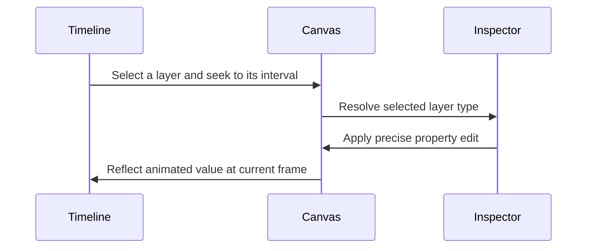

The workspace is a single editing surface with six functional regions. A selection or playhead move in one region immediately changes what the others show.

<Frame caption="Editor regions in a realistic layered timeline">
  
</Frame>

| Region | Primary job | Changes when… |
| --- | --- | --- |
| Floating top bar | Identify the draft, go to the previous page, and begin rendering | Project or render state changes |
| Left rail, panels, and Library modal | Browse the Bin, workspace Library media, and AI Search results | You switch media sources or open/close Library |
| Canvas | Preview and directly manipulate the current visual frame | The playhead, selection, or layer state changes |
| Right rail and inspector | Edit exact composition or selected-layer properties | Selection type changes |
| Playback controls | Navigate frames, preview motion, split, undo, and control viewing | Playback or editor history changes |
| Timeline | Arrange layers and edit their active frame intervals | Timing, stacking, or selection changes |

## The selection loop

You can select a layer from either the canvas or timeline. The inspector then swaps to the controls supported by that layer type. A video exposes transform, crop, playback, volume when audio is present, effects, and shadows; timeline handles author audio fades. Text exposes transform, typography, appearance, effects, and shadows; multiple selected layers expose shared geometry and alignment controls.

## Two coordinate systems

The timeline uses **frames along time**. The canvas uses **pixels inside the composition**. The playhead is the bridge: it chooses which frame of every active layer is evaluated, while the canvas shows the resulting spatial stack.

<Note>
  An item can be selected in the timeline while invisible on the canvas if the playhead is outside its active interval, it is hidden, its opacity is zero, or it is covered by a higher layer.
</Note>

## Rails versus panels

The narrow vertical rails choose a tool, panel, or modal. Bin and AI Search use the wider resizable panel beside the left rail; choosing an active one again can collapse it. Library opens a selection modal and clears the active left panel. The timeline height and left-panel width are resizable; the right inspector keeps a fixed width. These controls let you bias the workspace toward timing, composition, or detailed properties.

Next, follow the [first edit](/editor/getting-started/first-edit) to use every major region once.
