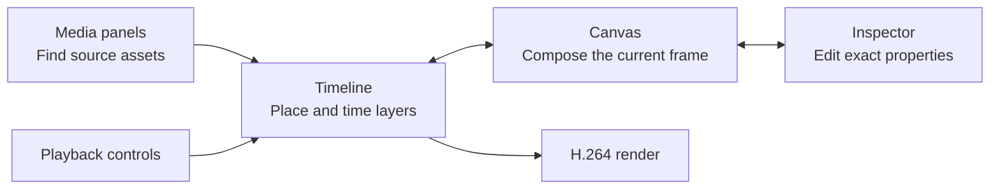

The Tessact Editor is a frame-accurate workspace for turning a video draft into a finished sequence. It brings media discovery, a layered canvas, a multitrack timeline, property inspectors, keyframe animation, captions, collaboration, and H.264 rendering into one view.

<Frame caption="A populated video draft open in the editor">
  
</Frame>

## Start with the mental model

The editor is easiest to understand as three synchronized views of the same composition:

- The **timeline** answers *when* a layer exists.
- The **canvas** answers *where and how* it appears at the current frame.
- The **inspector** exposes exact values and type-specific controls.
- Media panels answer *what source material* is available to add.
- Playback evaluates the whole stack over time; rendering turns that evaluation into a downloadable video.

## Choose a path

<Columns cols={2}>
  <Card title="Make your first edit" icon="wand-magic-sparkles" href="/editor/getting-started/first-edit">
    Open your video draft, replace a shot, refine timing, add a title, and preview the sequence.
  </Card>
  <Card title="Learn the timeline" icon="timeline" href="/editor/timeline/overview">
    Master selection, trimming, splitting, rolling edits, waveforms, fades, and frame-level navigation.
  </Card>
  <Card title="Compose on the canvas" icon="objects-align-center-horizontal" href="/editor/canvas/transforms">
    Position, size, rotate, crop, parent, and lay out layers with precise controls.
  </Card>
  <Card title="Animate with keyframes" icon="diamond" href="/editor/animation/overview">
    Build property tracks, edit values and timing, shape easing, and inspect motion paths.
  </Card>
  <Card title="Work with captions" icon="closed-captioning" href="/editor/captions/overview">
    Create, edit, time, style, and animate readable captions.
  </Card>
  <Card title="Render the result" icon="file-video" href="/editor/export/overview">
    Validate the sequence and create an H.264 output while monitoring progress.
  </Card>
</Columns>

## A reliable editing loop

<Steps>
  <Step title="Establish the story">
    Arrange the primary video and audio layers, then trim for rhythm before adding decoration.
  </Step>
  <Step title="Build the frame">
    Use the canvas and inspector to establish hierarchy, safe spacing, and consistent alignment.
  </Step>
  <Step title="Add communication layers">
    Introduce titles, captions, solids, shadows, and supporting imagery only where they clarify the story.
  </Step>
  <Step title="Animate deliberately">
    Keyframe the smallest useful set of properties, shape the easing, and test at full speed and frame by frame.
  </Step>
  <Step title="Review and render">
    Check first and last frames, audio transitions, caption timing, and layer visibility before starting the H.264 render.
  </Step>
</Steps>

<Tip>
  Work in passes. Timing changes made late can disturb carefully tuned captions, fades, and keyframes; lock the broad edit before polishing motion.
</Tip>

## Deep reference

For exact control coverage, use the [property matrix](/editor/reference/property-matrix), [context-menu matrix](/editor/reference/context-menus), [media matrix](/editor/reference/media-matrix), [keyboard reference](/editor/reference/shortcuts), and [frame-math guide](/editor/reference/timecode-frame-math).
