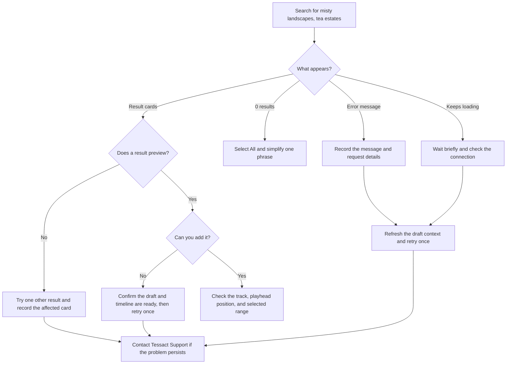

Use this guide when AI Search does not show the expected results, displays an error, cannot preview a result, or cannot add a result to the timeline. The most useful first step is to identify the last action that worked: submitting the search, loading the result grid, opening a preview, or adding the selected result.

## Identify the state you see

An empty search and a failed search can both leave the result area without cards, but they mean different things.

| What you see | What it means | Best next step |
| --- | --- | --- |
| `0 results` or a completed empty state | The search completed, but no matching media was found | Broaden the wording, remove one qualifier, or return the filter to **All** |
| **Search failed** or another error message | The search request did not complete successfully | Preserve the message and request details, then retry once |
| Search keeps loading | The request may still be pending or the connection may have stalled | Wait briefly; do not submit the same search repeatedly |
| Cards appear, but preview does not open or play | Search succeeded, but that result cannot currently be previewed | Try one other result and capture the affected result's title or thumbnail |
| Preview works, but **Add** fails | The result was found, but it could not be placed into the edit | Confirm the timeline is ready, retry once, and collect the visible error |
| A result is added in an unexpected place | The insert succeeded at a different playhead or track position | Undo once, set the playhead and target track, then add the result again |

<Tip>
  Keep the original query long enough to determine whether the issue is an empty result set or a failed request. Changing the query immediately can make two different outcomes look like the same problem.
</Tip>

## Quick troubleshooting flow



## Start with a reproducible search

If you need to compare results across attempts, use the same workspace, draft, filter, and query. This example is specific enough to make the test easy to recognize:

```text
misty landscapes, tea estates
```

Select **All**, submit the query once, and record:

- The local time and time zone
- The active workspace name and video draft title
- The selected AI Search filter
- The result-count text or exact error message
- Whether result cards appeared
- Whether preview and **Add** worked

Take a screenshot before refreshing if the error is visible. Include the entire AI Search panel and enough of the editor to show the draft is open, but exclude private browser information and unrelated workspace content.

## Check the editor context

Before investigating the search itself, confirm the editor is ready:

1. Make sure the expected workspace is active.
2. Confirm the correct video draft is open and has finished loading.
3. Wait for any active save or media-loading indicator to settle.
4. Open AI Search and select the intended filter.
5. Submit the query once and wait for a completed state.

If the Search action is unavailable, reload the video draft and reopen AI Search. If the action remains unavailable, capture a screenshot and contact Tessact Support rather than repeatedly signing out or changing workspace settings.

## When the search returns no results

A completed `0 results` state is not an error. It means the search ran successfully but did not find a close enough match for the current wording and filter.

Refine the search one change at a time:

1. Switch the filter to **All**.
2. Remove one descriptive phrase. For example, try `tea estates`.
3. Replace a highly specific visual adjective with a broader term.
4. Check spelling and place names.
5. Submit once and compare the new count.

Avoid changing several terms and the filter at the same time. A single change makes it easier to understand which refinement improved the results.

<Note>
  A successful empty search does not change the video draft. You can safely adjust the query without affecting the timeline.
</Note>

## When the search displays an error

Preserve the exact message before refreshing. Error wording, time, HTTP status, and a request ID can help Tessact Support locate the affected attempt much faster.

Try this recovery sequence:

1. Confirm the internet connection is stable.
2. Wait for any pending request to finish.
3. Allow the current draft to finish saving.
4. Reload the draft if the editor appears out of date.
5. Reopen AI Search, restore the same filter, and submit the same query once.
6. If the same error returns, stop retrying and collect the support details below.

Repeated submissions can make troubleshooting harder and may temporarily increase wait times. One retry after restoring the editor context is usually enough to determine whether the issue was temporary.

## Capture request evidence in the browser

This section is optional. Use it when Tessact Support asks for additional technical detail or when you are comfortable using browser developer tools.

<Steps>
  <Step title="Open the Network panel">
    Open your browser's developer tools, choose **Network**, and keep the panel open. Do not enable options that export cookies or browser storage.
  </Step>
  <Step title="Submit one identifiable search">
    In AI Search, submit `misty landscapes, tea estates` once. Use the request start time to identify the new search request in the Network list.
  </Step>
  <Step title="Record the safe fields">
    Note the HTTP method and status, total duration, environment hostname, and any request, correlation, or trace ID shown in the response headers. Also record the short error detail if one is present.
  </Step>
  <Step title="Redact before sharing">
    Review screenshots or copied values and remove authentication headers, cookies, signed URLs, and unrelated query parameters before sending them to Tessact Support.
  </Step>
</Steps>

The following evidence is useful and generally safe to share after review:

| Evidence | Why it helps |
| --- | --- |
| Local time and time zone | Narrows the search window for the affected request |
| Environment hostname | Identifies where the editor was opened |
| HTTP method and status | Distinguishes a completed request from a connection or service error |
| Request duration | Shows whether the response failed quickly or timed out |
| Request, correlation, or trace ID | Allows Support to correlate your report with service records |
| Exact visible error message | Preserves the customer-facing explanation shown by the editor |
| Query and selected filter | Makes the reported behavior reproducible |
| Browser and operating-system version | Helps identify browser-specific playback or network behavior |

<Warning>
  Never share passwords, session cookies, bearer tokens, authorization headers, signed media URLs, full browser-storage exports, or unredacted network archives. If Tessact Support needs a network archive, review and sanitize it before sending.
</Warning>

## Understand common HTTP statuses

If you captured an HTTP status in the Network panel, use this table as a first interpretation. The visible editor message remains the primary guidance.

| Status or browser evidence | What it commonly indicates | What to do |
| --- | --- | --- |
| `2xx` with `0 results` in the editor | The request completed with no close matches | Broaden the query or select **All** |
| `400` or `422` | The request could not be accepted | Capture the message and request ID; retry once after reloading the draft |
| `401` | The signed-in session may have expired | Sign in again through the normal login flow, reopen the draft, and retry once |
| `403` | The current account may not have access to the active workspace or draft | Confirm the active workspace and your membership; contact an administrator if needed |
| `404` | The requested service was not available at the current address | Confirm you are using the correct Tessact environment and contact Support if it persists |
| `429` | Too many requests were submitted in a short period | Stop retrying and wait for the indicated period before trying again |
| `500`, `502`, or `504` | A temporary service or gateway error occurred | Record the time and request ID, wait briefly, and retry once |
| `503` | AI Search was temporarily unavailable | Wait briefly, retry once, and contact Support if it remains unavailable |
| Canceled or aborted | The page changed, the request was replaced, or the connection ended | Keep the draft open and submit once more after the editor is stable |
| Browser network or CORS error | The browser, network, proxy, or security policy blocked completion | Capture the browser error and hostname; check whether another network has the same issue |

A `5xx` response is not a sign that the wording is too complex. Keep the original query, wait briefly, and retry once instead of repeatedly rewriting a valid search.

## When cards appear but preview fails

If result cards are visible, the search has completed. A preview problem is usually limited to the selected result or to media playback in the browser.

Check the following:

- Open one other result to learn whether the issue affects a single card or every card.
- Confirm the browser tab is allowed to play media.
- Check whether a company network, VPN, proxy, or privacy extension is blocking media playback.
- Reload the draft once if the poster remains blank or playback never starts.
- Record the affected card's visible title, source label, or thumbnail position.
- Note whether the poster loaded, whether audio was present, and whether the preview began at the expected moment.

Do not repeatedly click the same result while its preview is loading. If multiple results fail in the same way, include the browser version and a redacted screenshot of the Network error in the support report.

## When preview works but Add fails

A working preview confirms that the result can be viewed, but adding it also requires the editor and timeline to be ready.

1. Close the preview and confirm the draft is still responsive.
2. Place the playhead at the intended time.
3. Select or hover the intended track when the editing action requires a target track.
4. Open the result again and choose **Add** once.
5. Wait for the progress indicator or confirmation message to finish.
6. If an error appears, record its exact wording and confirm that no partial layer was added.

If a partial or unexpected layer appears, use **Undo** once before another attempt. Include the approximate playhead time, intended track, result identity, and the action used to add it in the support report.

## When a result is placed incorrectly

If the correct result appears at the wrong time or on the wrong track:

- Undo the insertion once.
- Move the playhead to the intended frame or time.
- Confirm the target track is visible and unlocked.
- Repeat the same add or drag action.
- Check the added clip's start point and selected range before continuing.

If the same result is consistently offset, report both the expected and actual timeline positions. Also include whether you clicked **Add** or dragged the result, because those interactions can use different placement context.

## Safe retry boundaries

- Submit a search only once while a loading indicator is active.
- Retry once after restoring the signed-in session, workspace, or draft context.
- For a persistent `5xx` response, wait briefly and retry once; then contact Tessact Support.
- Do not repeatedly click **Add** while an insertion is pending.
- After a failed add, confirm that no layer was created before trying again.
- Use **Undo** if an incomplete or incorrectly placed layer appears.
- Keep credentials and private media links out of screenshots and reports.
- Do not clear browser storage unless Tessact Support specifically asks you to do so and you understand that it will sign you out.

## Contact Tessact Support

Send the smallest complete report that reproduces the issue. You can copy this template:

```text
Video draft title:
Active workspace name:
Environment hostname:
Browser and operating-system version:
Query: misty landscapes, tea estates
Filter: All / Visual / Dialogue / Audio
Observed local time and time zone:
Visible result count or exact error message:
Did result cards appear? yes / no
Did preview work? yes / no / not reached
Did Add work? yes / no / not reached
Action used: Add / drag / not reached
Expected timeline position and track:
Actual timeline position and track:
Was the draft unchanged after the failure? yes / no / unsure
HTTP status and request duration, if available:
Request, correlation, or trace ID, if available:
Did the issue repeat after one reload and retry? yes / no
Screenshot attached and reviewed for secrets? yes / no
```

Include the video draft title, workspace name, approximate time, exact query, selected filter, and a redacted screenshot whenever possible. These details usually provide enough context for Tessact Support to investigate without exposing credentials or private browser data.
