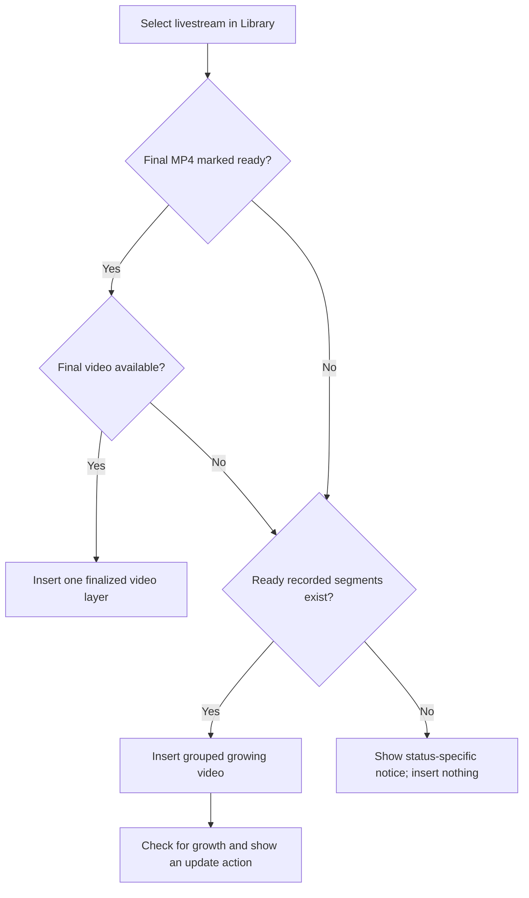

A livestream can appear as an asset in the editor's **Library**. It is still source media for the current video draft, but its bytes may be finalized, still arriving in ready chunks, or temporarily unavailable while recording and stitching progress.

## Import decision tree

When the final MP4 is ready and available, the editor inserts it as one video layer. Otherwise, the editor can use recorded segments that have finished processing. Segments still recording, processing, or unavailable are not inserted.

## Notices before media is ready

| Source state | Typical notice | Meaning |
| --- | --- | --- |
| Recording pending | **No livestream clips yet** | Recording has not produced a first chunk |
| Recording active, no chunk | **First chunk is not ready yet** | Wait for the first recorded chunk |
| Recording error | **Livestream recording failed** | No clips can be inserted |
| MP4 queued, stitching, or uploading with no clips | **Livestream clips are still processing** | Processing has not yielded importable media |
| MP4 processing error | **Livestream processing failed** | No clips are available |
| Final MP4 ready but neither URL nor clips usable | **No livestream clips found** | The source cannot currently build an editor layer |

These are availability states, not evidence that the draft is damaged. Wait for source processing or use another Library asset.

## Grouped timeline behavior

When only recorded segments are ready, Tessact represents them as one grouped video source. The timeline presents that source as one editorial unit even though playback can cross several recorded segments.

Playback-rate controls are intentionally hidden for a livestream group. Trim and split cautiously: a trimmed or detached group can preserve its own chunk mapping, and later source growth must not silently rewrite an intentionally detached edit.

## Detect and add newly recorded material

The editor checks imported livestreams periodically. When ready material extends beyond the grouped layer, the timeline displays an **Update live stream** placeholder and the selected-video inspector can show **Live Stream has grown** with the approximate recorded duration.

Choose **Update live stream** from the inspector notice or the purple timeline-end control to add the latest ready material. The update behaves like an ordinary undoable edit. While it is active, both controls show an updating state and prevent duplicate requests.

<Warning>
  Automatic polling discovers source growth; it does not guarantee that newly ready chunks are inserted into the authored sequence. Use the explicit update action, then review the previous end boundary, downstream timing, audio continuity, and the new final frame.
</Warning>

## Finalized versus growing sources

| Property | Finalized MP4 | Growing chunk group |
| --- | --- | --- |
| Media representation | One remote video asset | Multiple ready clip assets behind one grouped item |
| Can gain more material in place | No | Yes, through explicit update |
| Playback rate | Standard video behavior | Hidden for the group |
| Update placeholder | No | When more recorded material is detected |
| Availability check | Final file readiness and playback | Recording status, processed segments, and grouped playback |

After the livestream has a finalized MP4, a fresh Library insertion can prefer that consolidated file. Existing grouped edits remain authored timeline state; do not assume they are replaced automatically.

See [Library import](/editor/media/library), [Video inspector](/editor/layers/video), and [Media troubleshooting](/editor/troubleshooting/media).
