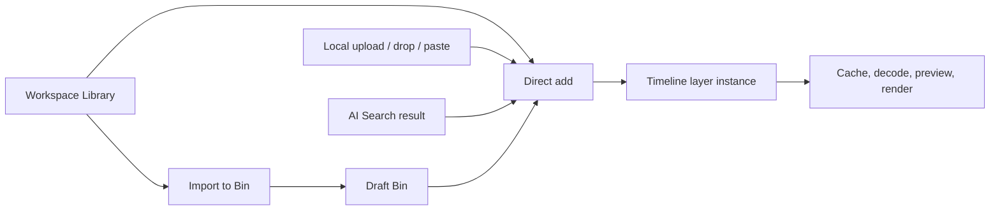

Media enters the draft through the **Bin**, the **Library** modal, **AI Search**, upload, direct file drop, or paste. Each source becomes a layer instance only when inserted into the composition.

## Source versus instance

A source records identity, media type, filename, duration or dimensions, thumbnails, and a remote URI. A timeline instance adds editorial state: start frame, duration, source in-point, transform, crop, opacity, playback rate, audio parameters, effects, shadows, keyframes, and parent layout.

## Choose an acquisition path

| Need | Best surface |
| --- | --- |
| Reuse an asset already associated with this draft | [Bin](/editor/media/bin) |
| Browse media in the active workspace | [Library](/editor/media/library) |
| Add a file from the computer | [Upload](/editor/media/upload) or [drag and drop](/editor/media/drag-drop-paste) |
| Find a supported workspace source by meaning | [AI Search](/editor/media/ai-search) |

## Prepare before insertion

Place the playhead at the intended start frame, confirm the target area of the timeline, and check composition dimensions. Direct **Add** actions insert at the playhead. A remote-card drop on the canvas uses the canvas pointer; a remote-card drop on the timeline uses the pointer-derived frame and hovered track. An operating-system file dropped on the timeline still uses the current playhead. Source-backed media can be resized after insertion, but a deliberate initial frame reduces unnecessary moves and avoids an accidental layer at frame zero.

<Note>
  Bin association and timeline insertion are separate actions. Library can import assets into the draft Bin, but Library's in-editor selection can also add media directly to the timeline without routing it through the Bin first.
</Note>

See the [media matrix](/editor/reference/media-matrix) for type-specific behavior.
