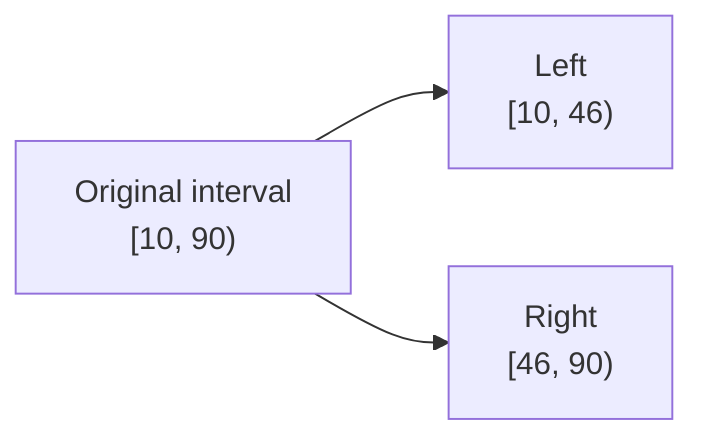

Split creates two layer intervals from each eligible target at the current playhead. If eligible layers are selected, it targets that selection. If none is eligible or selected, the global split command falls back to all eligible clips under the playhead on non-hidden tracks. It is useful for removing a middle section, applying different properties before and after a beat, or isolating a region for timing changes.

<Frame caption="The clip context menu near a split point">
  
</Frame>

## Split safely

1. Select every intended target in the timeline. If you want only one clip, select only that clip.
2. Place the playhead strictly inside its interval—not on the first frame or exclusive end.
3. Use the split control in the playback strip or the available clip command.
4. Confirm two independently selectable clips meet at the same boundary.
5. Play across the boundary to check visual and audio continuity.

## Timing across the boundary

The two results inherit ordinary properties, effects, and shadows, while time-based data such as keyframes and fades is divided or shortened to fit each new interval. The composition intervals meet at the same boundary.

Standard `1×` video and audio usually remain continuous across that boundary. Speed-adjusted video or audio, and animated GIFs, need an additional review because the first frame of the right result may not match the expected source moment. Frame-step across the edit, listen for a repeated or skipped sample, and undo the split if the boundary is not clean. For precision work, make the structural split at `1×`, verify it, and then apply and review speed changes on the resulting clips.

## After splitting

- Move or delete one side to create a structural edit.
- Apply a different crop, volume, effect, or animation to one side.
- Add short complementary fades if an audio discontinuity appears.
- Rename or visually separate the pieces if later selection could be ambiguous.

<Warning>
  Unlink a video/caption pair before splitting either layer. A split does not rebuild the source relationship across the resulting pieces. Keep the pieces independently timed, or recreate captions from the intended source video when you need a linked caption layer.
</Warning>

<Note>
  At `1×`, an ordinary video or audio split should usually remain continuous. Always inspect the boundary; for non-`1×` media and GIFs, treat continuity as unverified until frame-stepped and heard.
</Note>

See the [context-menu matrix](/editor/reference/context-menus) and [audio fades](/editor/timeline/audio-fades).
