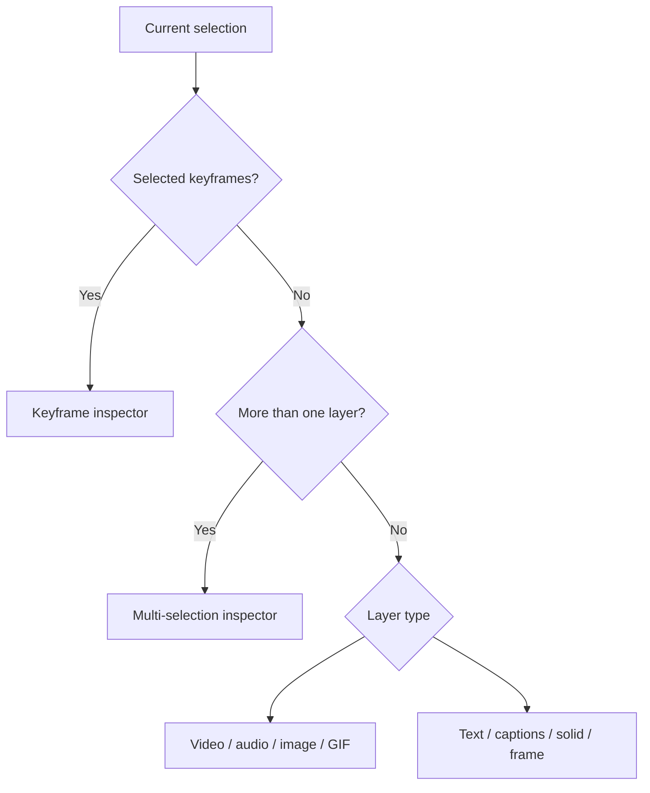

import { SelectionWarning } from '/snippets/editor-notes.mdx'

The right rail combines selection tools with two primary panels: **Inspector** and **Canvas settings**. The inspector is polymorphic: its sections are determined by the selected layer type and selection count.

<Frame caption="A video layer exposing transform controls">
  
</Frame>

## Rail destinations and tools

| Control | Purpose |
| --- | --- |
| Inspector | Edit the selected layer, selected keyframes, or a multi-selection |
| Canvas settings | Edit composition-wide width and height; inspect passive duration and the currently disabled FPS field |
| Select | Return to ordinary selection and manipulation |
| Frame | Draw a frame container on the canvas |
| Solid | Draw a colored shape layer |
| Text | Insert a text layer, then type or edit its content |

The visible tooltip is the authority for a control's current shortcut. Common labels include **Inspector** (`⌘7`), **Canvas settings** (`⌘8`), **Select** (`V`), **Frame** (`F`), **Solid** (`R`), and **Text** (`T`). Input focus can reserve these keys for typing.

## Inspector resolution order

Collapsed sections preserve vertical space. Expand only what the current task needs; for example, keep **Transform** and **Crop** open during reframing, then switch to **Effects** and **Shadows** during finishing.

## Open, close, and scroll lifecycle

Selecting an inspectable layer normally opens the Inspector automatically. If you close it manually, that choice is sticky: later selections do not force it open again. Reopen it from the right rail or with `Cmd/Ctrl+7`. Pressing `Escape` closes the active inspector/panel before lower-priority selection clearing takes over.

The Inspector remembers vertical scroll independently for the active item or keyframe-selection key. Returning to a previously inspected target can therefore restore the section you were viewing instead of always starting at the top. When teaching or diagnosing an edit, name the section as well as the layer—two users can select the same layer and see different scroll positions or collapsed sections.

<SelectionWarning />

See the [property matrix](/editor/reference/property-matrix) for a type-by-type inventory.
